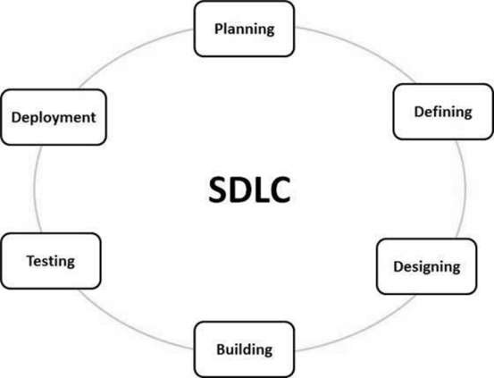

## Software Delivery Cycle
Software Development Life Cycle (SDLC) is a process used by the software industry to design, develop and test high quality softwares. The SDLC aims to produce a high-quality software that meets or exceeds customer expectations, reaches completion within times and cost estimates.

   
    
Following are the most important and popular SDLC models followed in the industry:           
- Waterfall Model     
- Iterative Model     
- Spiral Model        
- V-Model     
- Big Bang Model        
Other related methodologies are Agile Model, RAD Model, Rapid Application Development and Prototyping Models.

	
## Test Driven Development
Test Driven Development (TDD) is software development approach in which test cases are developed to specify and validate what the code will do. In simple terms, test cases for each functionality are created and tested first and if the test fails then the new code is written in order to pass the test and making code simple and bug-free.

    
    

## Continuous Integration
Continuous Integration (CI) is a development practice where developers integrate code into a shared repository frequently, preferably several times a day. Each integration can then be verified by an automated build and automated tests. While automated testing is not strictly part of CI it is typically implied.

One of the key benefits of integrating regularly is that you can detect errors quickly and locate them more easily. As each change introduced is typically small, pinpointing the specific change that introduced a defect can be done quickly.

This is the practice of integrating changes from different developers in the team into a mainline as early as possible, in best cases several times a day. This makes sure the code individual developers work on doesn’t divert too much. When you combine the process with automated testing, continuous integration can enable your code to be dependable.

## Continuous Delivery
This is the practice of keeping your codebase deployable at any point. Beyond making sure your application passes automated tests it has to have all the configuration necessary to push it into production. Many teams then do push changes that pass the automated tests into a test or production environment immediately to ensure a fast development loop.

    

## Configuration Management
## Containerization
Containerization is defined as a form of operating system virtualization, through which applications are run in isolated user spaces called containers, all using the same shared operating system (OS). A container is essentially a fully packaged and portable computing environment:
- Everything an application needs to run – its binaries, libraries, configuration files and dependencies – is encapsulated and isolated in its container.
- The container itself is abstracted away from the host OS, with only limited access to underlying resources – much like a lightweight virtual machine (VM).
- As a result, the containerized application can be run on various types of infrastructure—on bare metal, within VMs, and in the cloud—without needing to refactor it for each environment.
## Cloud Scalability, and Reliability

## Software Architecture / Software Architecture Patterns
### Client / Server
Client Server Architecture is a computing model in which the server hosts, delivers and manages most of the resources and services to be consumed by the client. This type of architecture has one or more client computers connected to a central server over a network or internet connection. This system shares computing resources. Client/server architecture is also known as a networking computing model or client/server network because all the requests and services are delivered over a network.      

Client-server architecture is an architecture of a computer network in which many clients (remote processors) request and receive service from a centralized server (host computer). Client computers provide an interface to allow a computer user to request services of the server and to display the results the server returns. Servers wait for requests to arrive from clients and then respond to them. 

